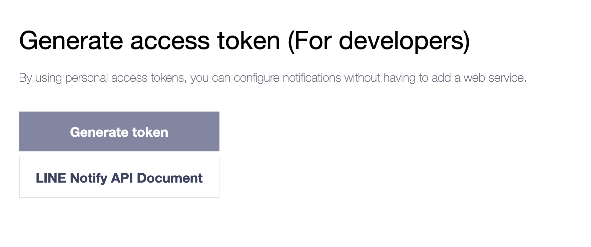
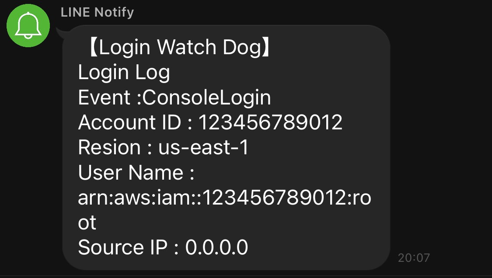
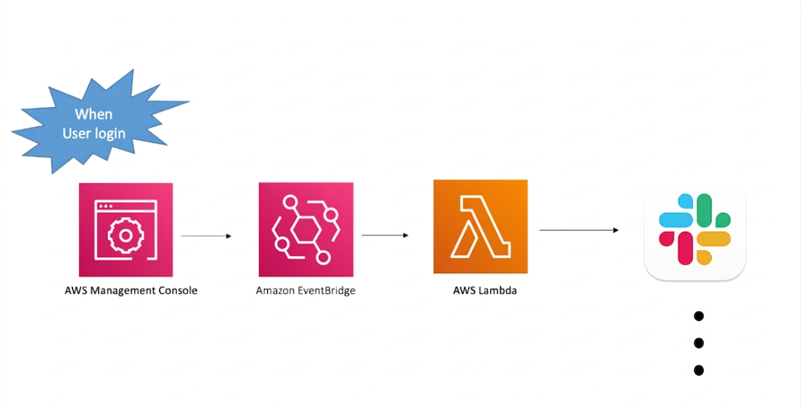

[](https://badge.fury.io/js/cdk-events-notify)
[](https://badge.fury.io/py/cdk-events-notify)


# cdk-events-notify
cdk-events-notify is an AWS CDK construct library that provides you know who login in your aws console. 
## Welcome to contribute another event notify case you want.
### Now support 
- Line Notify


# You need Line Notify access token
> more see [line notify docs](https://notify-bot.line.me/doc/en/) 



## Usage 
```ts
import * as cdk from '@aws-cdk/core';
import { EeventNotify } from 'cdk-events-notify';

const app = new cdk.App();
const stack = new cdk.Stack(app, 'integ-stack', { env });
new EeventNotify(stack, 'LineEeventNotify', { lineNotifyToken: process.env.LINE_NOTIFY_TOKEN });

```
### To deploy
```bash
cdk deploy
```
### To destroy
```bash
cdk destroy
```
### Finally


### Overview 


## More about EventBridge and Lambda
- [EventBridge](https://docs.aws.amazon.com/eventbridge/latest/userguide/aws-events.html)
- [Lambda](https://docs.aws.amazon.com/lambda/latest/dg/welcome.html)
> Note: Event Bridge can not cross region , if you console sign in not the cdk-events-notify region will not get the evnet in cloudtrail see this [docs](https://docs.aws.amazon.com/IAM/latest/UserGuide/cloudtrail-integration.html#cloudtrail-integration_signin-regions)

## :clap:  Supporters
[](https://github.com/guan840912/cdk-events-notify/stargazers)
[](https://github.com/guan840912/cdk-events-notify/network/members)