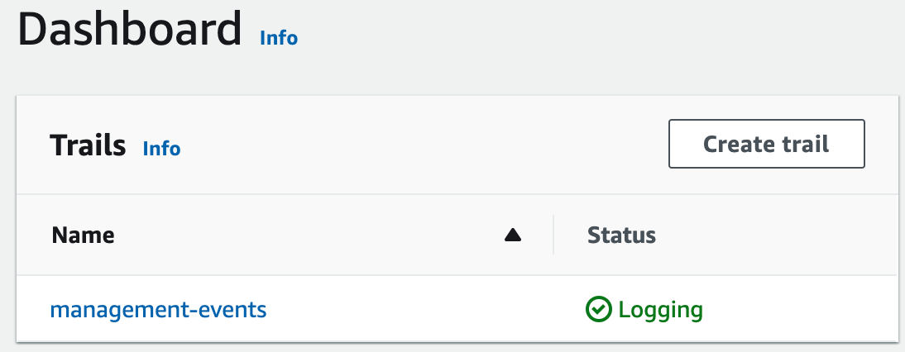
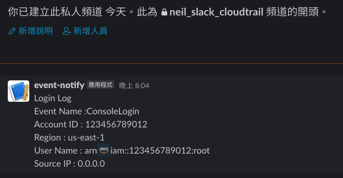

[](https://badge.fury.io/js/cdk-events-notify)
[](https://badge.fury.io/py/cdk-events-notify)


# cdk-events-notify
`cdk-events-notify` is an AWS CDK Construct Library that provides you know who login in your aws console.

## Why
It’s just a small feature at the moment,
Provides you to trigger Lambda Function push notifications to Line Notify or Slack when you discover Console Login event or swith role event through Cloudtrail.

> Welcome to contribute another event notify case you want.

## Overview 


### Now support
- Line Notify
- Slack ([webhooks](https://api.slack.com/messaging/webhooks#posting_with_webhooks))

## You need enable one `Management events` in your account.
> more see https://aws.amazon.com/tw/cloudtrail/pricing/

# You need Line Notify access token
> more see [line notify docs](https://notify-bot.line.me/doc/en/) 


## Install
```bash
Use the npm dist tag to opt in CDKv1 or CDKv2:

// for CDKv2
npm install cdk-events-notify
or
npm install cdk-events-notify@latest 
```
## 💡💡💡 please click [here](https://github.com/neilkuan/cdk-events-notify/tree/cdkv1#readme), if you are using aws-cdk v1.x.x version.💡💡💡


## Usage 
```ts
import * as cdk from 'aws-cdk-lib';
import { EventNotify } from 'cdk-events-notify';

const app = new cdk.App();
const stack = new cdk.Stack(app, 'integ-stack', { env });
new EventNotify(stack, 'LineEventNotify', { lineNotifyToken: process.env.LINE_NOTIFY_TOKEN });

```
### To deploy
```bash
cdk deploy
```
### To destroy
```bash
cdk destroy
```
### Finally
- line
  
- slack
  

## More about EventBridge and Lambda
- [EventBridge](https://docs.aws.amazon.com/eventbridge/latest/userguide/aws-events.html)
- [Lambda](https://docs.aws.amazon.com/lambda/latest/dg/welcome.html)
> Note: Event Bridge can not cross region , if you console sign in not the cdk-events-notify region will not get the evnet in cloudtrail see this [docs](https://docs.aws.amazon.com/IAM/latest/UserGuide/cloudtrail-integration.html#cloudtrail-integration_signin-regions)

## :clap:  Supporters
[](https://github.com/neilkuan/cdk-events-notify/stargazers)
[](https://github.com/neilkuan/cdk-events-notify/network/members)
